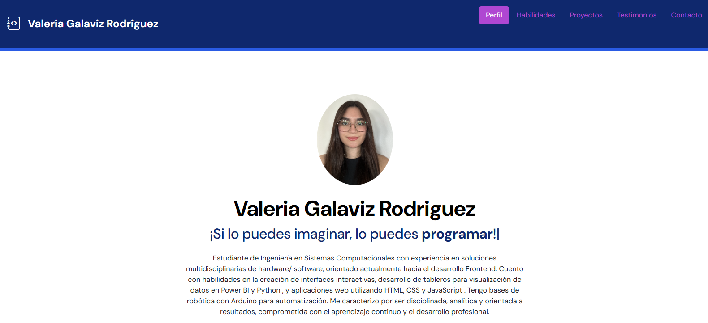
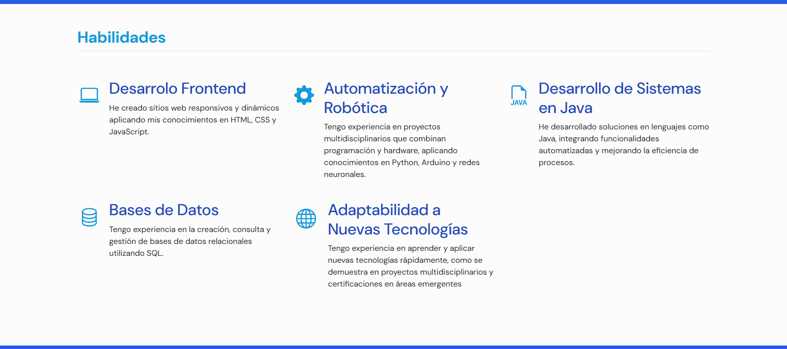
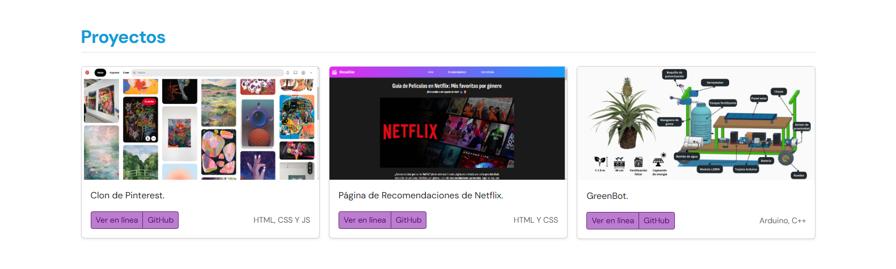
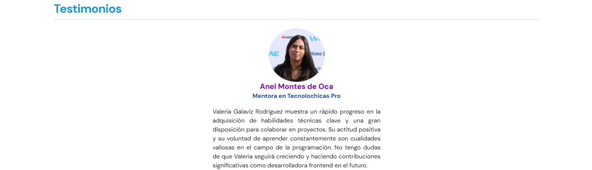
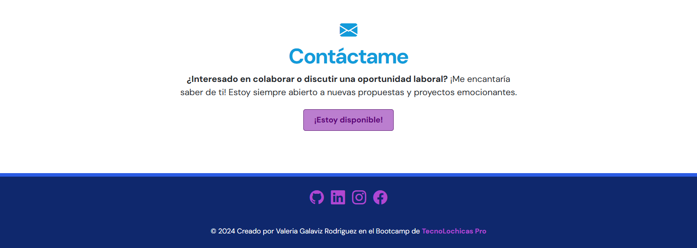

##Portafolio de Proyectos

¡Hola! Soy ***Valeria Galaviz***, desarrolladora web Jr💻. Apasionada por la tecnología, aquí encontraras información sobre mí.

### El proyecto cuenta con las secciones de:

- 💪Habilidades
- 📁Proyectos
- 🗣️Testimonios
- ✉️Contacto

### Creado con:
- HTML
- CSS
- JavaScript

### Vista previa

### *Espero poder colaborar contigo pronto!*

Para cualquier pregunta o comentario, puedes contactarme a través de los siguientes medios: 
- **GitHub**: [Valeriagalaviz](https://github.com/Valeriagalaviz) 
- **Correo Electrónico**: [valeriagalavizrodriguez@gmail.com](valeriagalavizrodriguez@gmail.com)